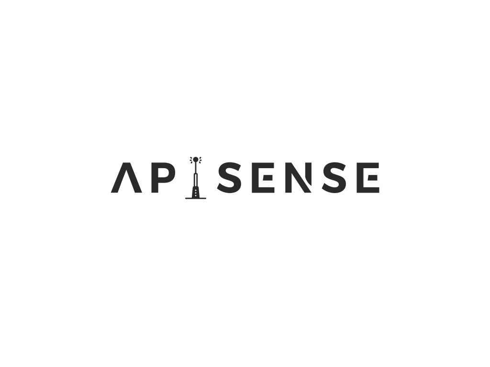

# Apisense




Apisense is a project that is used to monitor given endpoints in the most flexible way and generate reports about the
state of the returned data. If you want to know more check: [About](./About.md)

## Installation

Currently, the project is not available on any package manager. You can still install it by using the go package manager or cloning the repository and
building it with go.

### Install with go install
```shell
go install github.com/buonotti/apisense@latest
```

### Build from source

```shell
git clone https://github.com/buonotti/apisense
cd apisense
go build
go install # make sure you add $GOPATH/bin to your $PATH (in most cases it's ~/go/bin)
```

If you have [go-task](https://taskfile.dev) installed you can install the project with `task install` or `go-task install`.

## Usage

```shell
apisense --help # Get help about the available commands
apisense help <command> # Get help about a specific command
```

### The daemon

The daemon is the main component of the project. It is responsible for monitoring the endpoints and generating reports.

```shell
# Start the daemon
apisense daemon start

# Stop the daemon
apisense daemon stop

# Get the status of the daemon
apisense daemon status
```

The generated reports are stored in the following location (`~/apisense/reports`).

The daemon uses so-called definition files to know which endpoints to monitor. These files are stored in the following
directory (`~/apisense/definitions`).

Upon installation, the daemon will create a default definition file. You can add more definition files with the same
format to the definitions directory to monitor you own endpoints.

The daemon will reload the definition files before each monitoring cycle. This means that you can add or remove
definitions without having to restart the daemon.

The example definition file can be found
here: [bluetooth.toml](https://github.com/buonotti/apisense/blob/dev/assets/bluetooth.definition.toml)

### The TUI

The TUI is a terminal user interface that allows you to monitor the state daemon and the reports in real time. It also
provides a streamlined way to edit the daemon's config (See [Configuration](#configuration)).

```shell
# Start the TUI
apisense tui
```

### The SSH server

The ssh server serves the tui over ssh so that it can be accessed easily from a remote machine. The ssh server also has
scp server->client enabled so that the reports can be downloaded from the server.

```shell
# Start the ssh server
apisense ssh
```

### The API

The API is a simple REST API that allows to browse the reports. The currently available endpoints are:

The base path of the API is `/api/` and the default port is `8080`.

- `/reports` - List all reports
- `/reports/<report_id>` - Get a specific report
- `/health` - Get the health of the api

You can add a where query to filter the results. The where query is in the form of `?where=<key>.operator.<value>`.
The available operators are:

- `eq` - Equals
- `neq` - Not equals
- `gt` - Greater than
- `gte` - Greater than or equals
- `lt` - Less than
- `lte` - Less than or equals
- `contains` - Contains (only for arrays)
- `ncontains` - Does not contain (only for arrays)

Currently searching in arrays is not supported. The <key> is a json path following
the [gjson](https://github.com/tidwall/gjson) format.

## Configuration

The daemon can be configured by editing the config file (`~/.config/apisense/apisense.config.yml` or `~\AppData\Local\apisense\apisense.config.yml`).
The config file if not present will be added upon first start of the app (daemon or not).
The example config file can be found
here: [config.toml](https://github.com/buonotti/apisense/blob/dev/assets/config.example.toml)

## Docker

There will be made a docker image available soon on [dockerhub](https://hub.docker.com).

Meanwhile, you can build and run the docker image yourself with the following commands:

```shell
# Build the docker image
docker build -t apisense --build-arg BRANCH=dev .

# Run the docker image
docker run -it --rm -p 23232:23232 -p 8080:8080 --name apisense apisense
```

If you have [go-task](https://taskfile.dev) installed you can build the docker image and run the container with one
command with `task docker`.

## Contribution

The project is still in the early stages of development. If you want to contribute or have a issue to report make sure
you open a [GitHub Issue](https://github.com/buonotti/apisense/issues/new) because we might already be working on it.

## License

[MIT](https://choosealicense.com/licenses/mit/)
